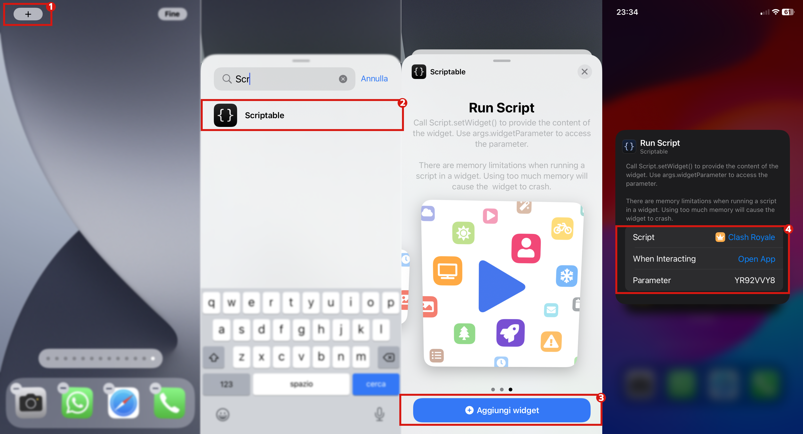

## Add widget to the home-screen

1. Add a new Scriptable widget to the home-screen.
2. In "Script" select **Clash Royale**.
3. In "Parameter" insert your **player tag** (or it will show the default one set in the script).