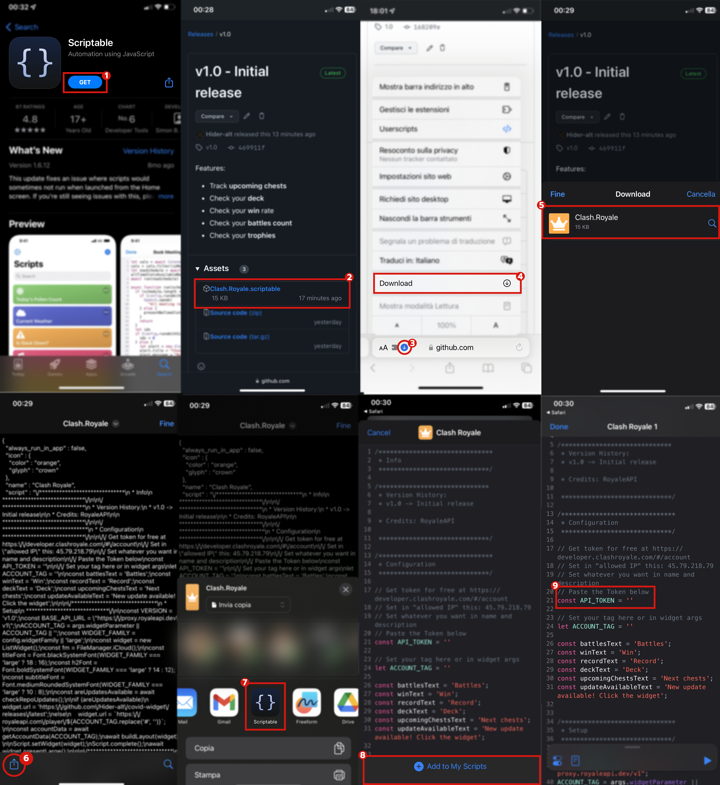

## How to install

1. Download Scriptable from the App Store.
2. **Download** the Scriptable file from the [release page](https://github.com/Hider-alt/cr-widget/releases/latest).
3. Once downloaded, click the Share button.
4. Click on the Scriptable icon.
5. Click on "Add to My Scripts".
6. Set constants at the top of the script
    1. **API_TOKEN**:
        1. Log in or register on [Clash Royale API](https://developer.clashroyale.com/#/login).
        2. Go to [My Account](https://developer.clashroyale.com/#/account).
        3. Click on "Create New Key".
        4. Set whatever name and description you want
        5. Set in "**Allowed IP Addresses**" the following IP: `45.79.218.79`
            * _This is needed because the script uses RoyaleAPI's proxy._
    2. **ACCOUNT_TAG** _(optional)_: Your Clash Royale player tag that will be used as default.
    3. **Translate** widget texts in your language _(optional)_
7. Click on "Done".
